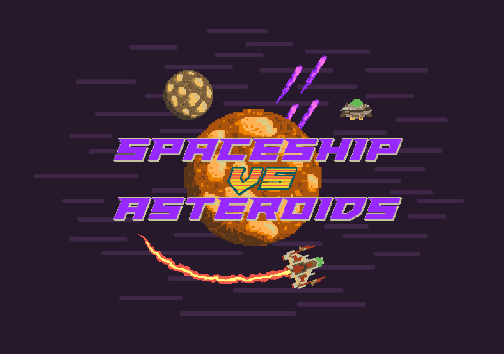
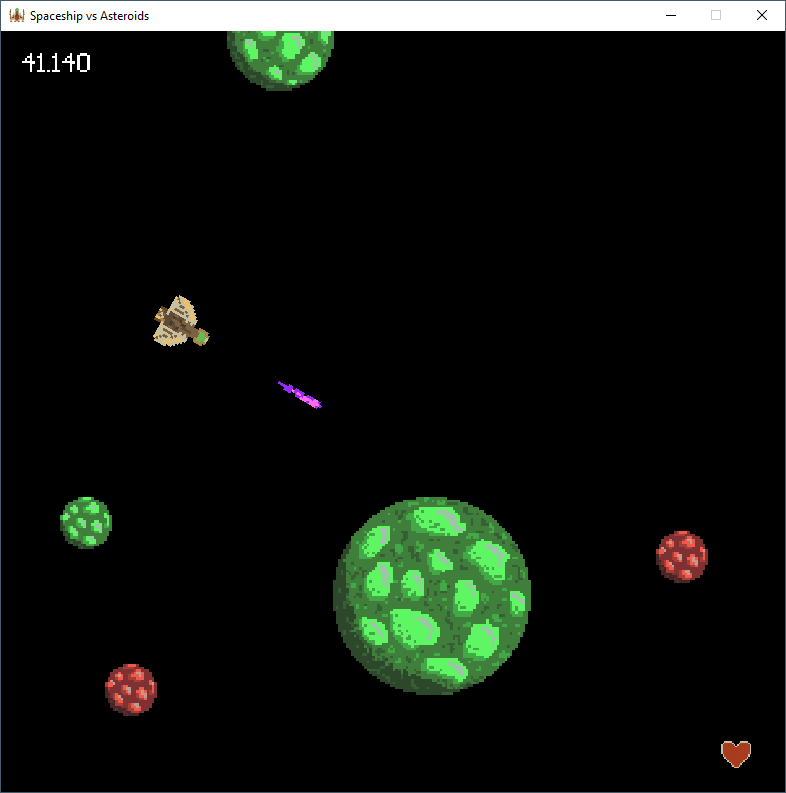
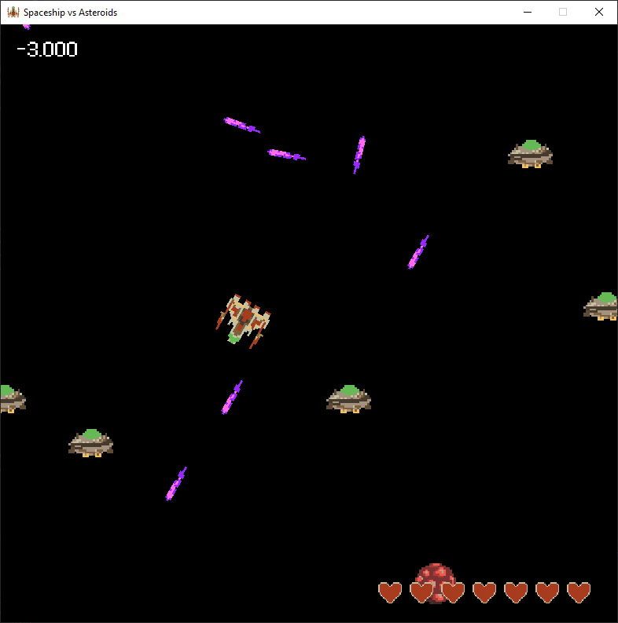
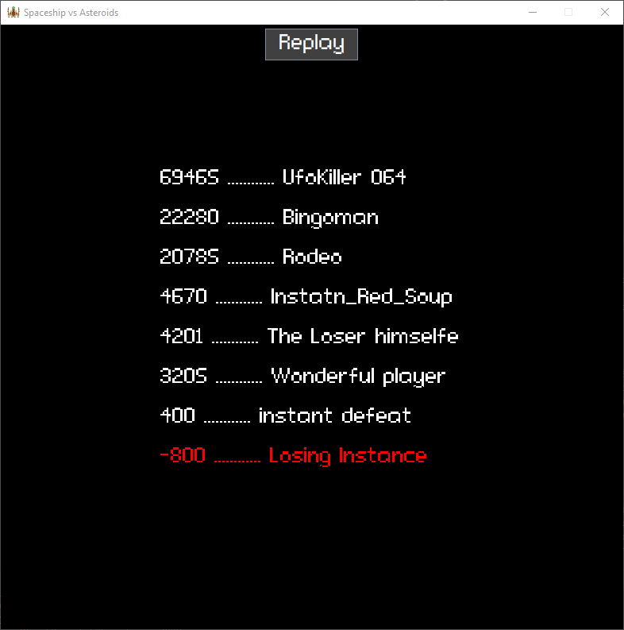

This is a 2D retro themed space shoot ’em up. As a spaceship pilot you are defending earth from asteroids and bad alien. This Game is a tribute to the classic 1980 arcade games. 
It took us about six days to code the game from scratch. We used Java for the entier game and Swing for the visualisation. The biggest challenge during the production was the setup of the project structure for a project of this size. From a technical point of view we had to implement trigonometry functions and vektor calculations. The pixle design of the game elements is also created by us.

